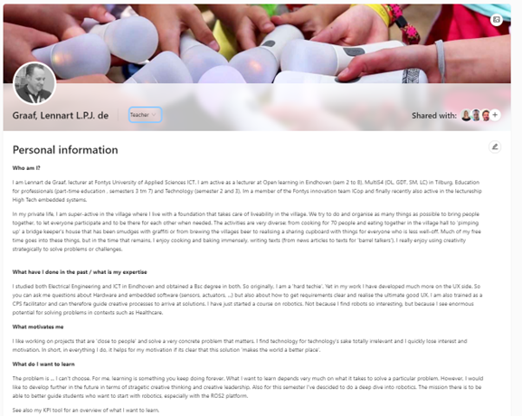
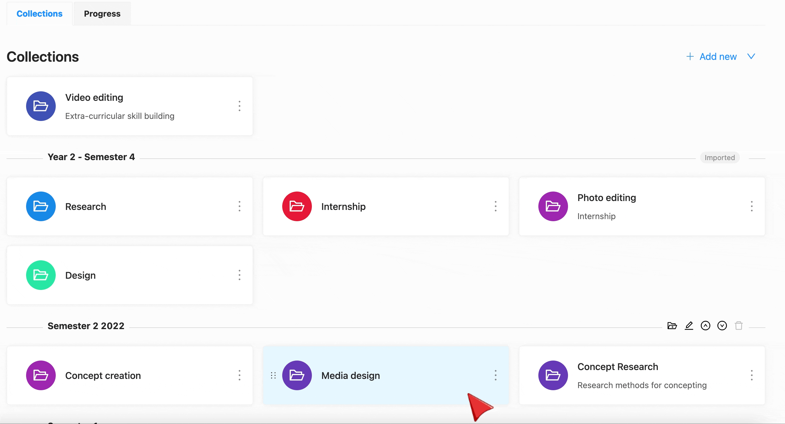
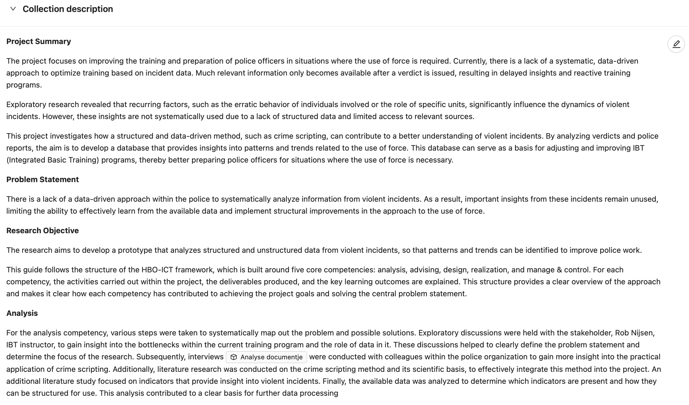
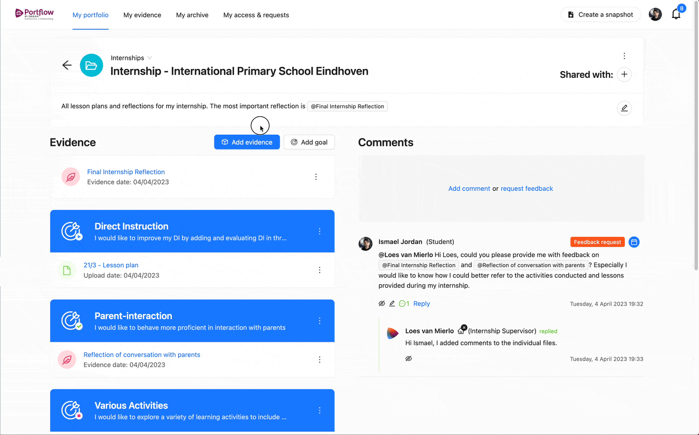
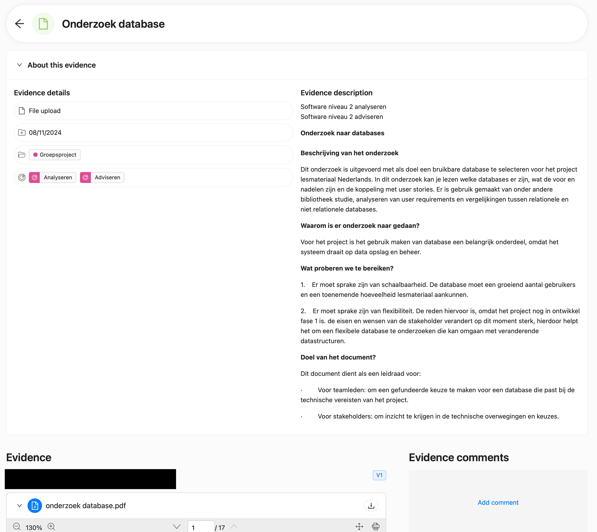
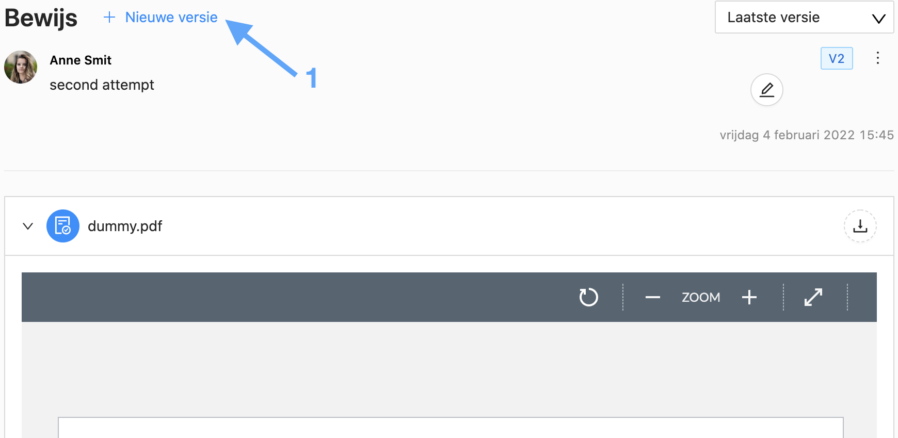
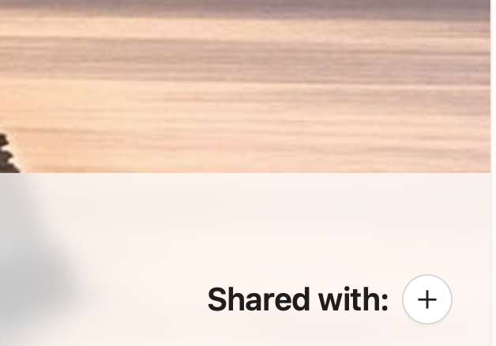
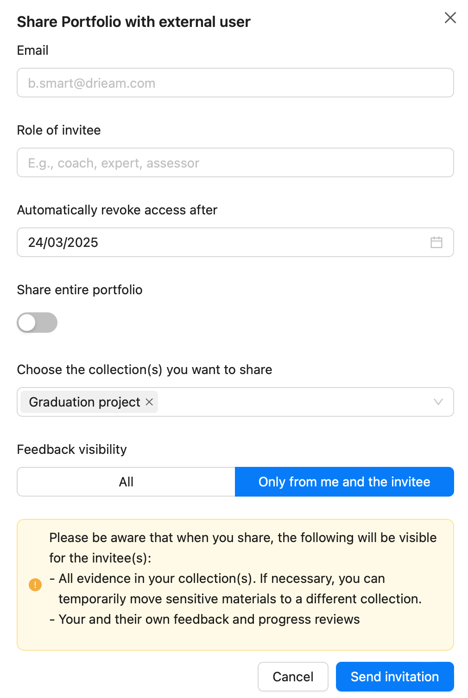
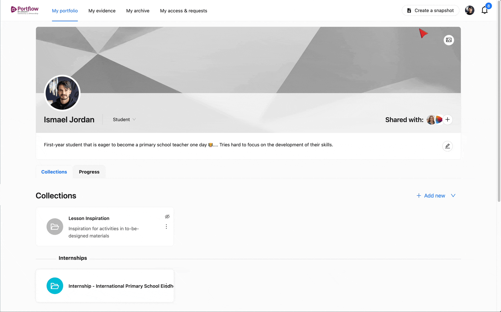

# Portflow at Fontys ICT - Manual

# 📋 Portflow at Fontys ICT - Manual

Complete guide for creating and managing your portfolio

**🎯 What you'll learn:** During this semester, you will use the portfolio tool Portflow to show the progress of your projects by collecting products and requesting feedback from teachers, students, and experts.

## Quick Navigation

1. **Create your portfolio**
   * Import Portflow template
   * Introduction page
   * Sections
   * Collections
   * Goals
   * Collection description
   * Products/Evidence
2. **Share your portfolio with others**
3. **Request feedback on your portfolio**
4. **Submit your portfolio**
   * Create a snapshot
   * Submit your portfolio

## 1. Create your portfolio

You can find the portfolio in the left menu of Canvas:

Import the Portflow template

**🔑 Template Code:** Use template code on page [Creating a Portfolio](https://fhict.instructure.com/courses/15759/pages/creating-a-portfolio "Creating a Portfolio")

#### Steps to import template:

1. Click on **'+ add new'** at the introduction page
2. Click on **'import template'**
3. Enter the template code. A preview will show the creator, sections, collections and goals.
4. If this is correct, click on **'import'**

Introduction page

The introduction page is the first thing readers see. Make sure to give this proper attention. Edit the text box by clicking the pencil icon.

 **📝 Include these elements:** * A profile sketch with photo

* Your name and personal motto
* Educational background and qualifications
* Relevant work experience
* Motivation for pursuing this study
* Learning goals and professional aspirations
* Professional development goals
* Optional: what motivates you

Example: an introduction page

### Sections

Sections help organize and distinguish between different semesters in your portfolio overview.

**📋 To Do:** Create a section for this semester: **Semester X - `<title>`**

#### Create a section

A new section can be created from the Portflow home page:

1. Click on **'+ Add new'**
2. Click on **'Section'**
3. Give the section a **name**

Example: creating a section

### Collections

Structure your portfolio by creating collections within a section. Within a collection, you can place products and gather feedback in the context of your completed projects. This approach aligns with [the educational vision**Links to an external site.**](https://beleidswiki.fhict.nl/doku.php?id=beleid:onderwijsvisie&s[]=%2Avisie%2A) of Fontys ICT and its associated [assessment policy**Links to an external site.**](https://beleidswiki.fhict.nl/doku.php?id=beleid:toetsbeleid&s[]=%2Atoetsbeleid%2A).

 **📋 To Do:** * Create a collection for each project: **Your (Group) Project - `<Project Name>`**

* If you have an individual project: **Individual project - `<Project Name>`**
* Optionally, create a collection for non-curricular activities (MR participation, student association, etc.)
  Example: a collection

#### Create a collection

A new collection can be created from the Portflow home page:

1. Click on **'+ Add new'**
2. Click on **'Collection'**
3. Give the collection a **name** (required) and a **subtitle**
4. Click on **'Add'**

Example: steps to create a collection

### Goals

Through goals, you bring more structure within a collection. You can reflect the goals in multiple collections when you work on the learning outcomes across multiple projects.

 **📋 To Do:** Create a goal per Learning Outcome:

* Analysis
* Design
* Implementation
* Managing
* Professional Standard
* Personal Leadership

Example: steps to create a goal in a collection

#### Create a goal

Within a collection:

1. Click on **'+ Add Goal'**
2. Click on **'New Goal'**
3. Give the goal a short **name** (required),  **long name** , and **description**
4. Choose the **status** of the goal
5. Click on **'Save'**

### Collection description

The collection description is the first thing readers encounter after the introduction page. It provides insight into what they can expect and the context of your portfolio structure.

 **📋 To Do:** * **Background** – Describe the problem or opportunity that led to the assignment, objective, and business context

* **Process** – The core section describing execution. Structure this based on your process:
  * What problem or research question did you start from?
  * What is the context/background?
  * How did you approach this phase? What methods/strategies?
  * What is the result?
  * What is the conclusion?

**💡 Tip:** Use references to supporting evidence in your text by typing @'name of the evidence piece'

Example: a collection description

### Products/Evidence

In your portfolio, you include products (evidence). Examples include: professional products, assignments, presentations, reports, performance assessments, deliverables, interviews, and the feedback you receive. Anything that contributes to demonstrating the learning outcomes. Maximum file size: 500MB per file.

 **📋 To Do:** * Link a product to (at least) one collection

* Link a product to one or more goals (learning outcomes)
* Always provide a learning product with an **'evidence description'**

#### Upload a product (evidence)

1. Click on **'+ add evidence'** in 'my evidence' or in a collection
2. Select **'file upload'**
3. Give your product a **name** (can be changed later)
4. Choose one or more **files** to upload from your computer
5. Click on **'Add'**

#### Link evidence to goals

1. Click on the **three dots (⋮)** on the evidence card within the collection
2. Click on **'add to (sub)goal(s)'**
3. Select one or more goals and sub-goals to link the evidence
4. Click on **'Add'**

Example: steps to create an evidence

#### Evidence description

In the evidence description, specify:

* What type of learning product it is (1-2 sentences)
* What the goal of the learning product is (Who did you create it for? What does it deliver?)
* Why this learning product contributes to demonstrating the learning outcomes

Example: an evidence description

#### Add Evidence versions

Add new versions of evidence to provide insight into your progress and received feedback.

1. Click on **'+ new version'** on the evidence page
2. Select the new version of the evidence (upload new version or create new version)
3. Give a short **description** of what has changed
4. Click on **'add'**

Example: steps to create an evidence version

## 2. Share your portfolio with others

You can make your portfolio available to coaches, teachers, fellow students, and experts. After sharing, others can view your products and provide feedback.

**📋 To Do:** Share your portfolio with individuals who can provide feedback and insight into your project progress:* Your coaches

* Experts
* Students

#### Share within Fontys

You can share your portfolio in two ways:

1. **Your entire portfolio**
   * Click on **"Shared with:"** on your introduction page
2. **Per collection**
   * Click on **"Share"** within the specific collection

#### Share with external parties

1. Go to the **portfolio introduction page**
2. Click on the **plus icon (+)** next to **"Shared with"**
3. Click on **'click here to invite external users'**
4. Enter the  **name** , **email address** and **role** of invitee
5. Select **how long** you want to give access
6. Configure privacy settings as needed
7. Click on **'Send invitation'**

Example: "Shared with" button on the introduction page

Example: Share button within a collection

Example: an external sharing interface

## 3. Request feedback on your portfolio

During the semester, request **feedback** from stakeholders whenever you add new products to your portfolio. This allows continuous improvement and helps your assessor gain insight into your progress.

You can send a **feedback request** to individuals who have access to your portfolio. In your request, clearly describe what you would like feedback on. When you send a request, the recipient receives a **notification** and can respond accordingly.

#### Sending a feedback request

1. Make sure the user is invited to your collection or portfolio
2. Click on **'request feedback'** on the collection or evidence page
3. Select the **role** you're requesting feedback from
4. Select the **person** you want to request feedback from
5. Select a suggested **deadline** for the feedback
6. Carefully describe what you would like feedback on
7. Optional: Request feedback related to a **specific goal**
8. Add **attachments** or audio/video recordings if desired
9. Click on **'send'**

Example: request feedback on your portfolio

## 4. Submit your portfolio

To submit a portfolio for your project plan, midterm review, concept portfolio and final portfolio, you must first create a **frozen version (snapshot)** of your portfolio. You can continue working in your  **live portfolio** , while the **snapshot** remains unchanged.

### Create a snapshot

1. Click on **'Create a snapshot'** in the menu at the top right
2. Click **'next'** if you don't want to change your profile information
3. Select **which collections** (including feedback and previous versions) you want to include
4. For each collection, select **which evidence** you want to include
5. Assign a **name** and **description** to this snapshot
6. Click **'view your copy'** to view the snapshot

Example: create a snapshot

### Submit your portfolio

1. Go to the **course** and **assignment** where you want to submit your portfolio
2. Click on **'More'**
3. Select **'Portfolio'** from the drop-down menu
4. Choose the **snapshot** you want to submit for this assignment
5. Click on **'Submit assignment'**

Example: submit your portfolio

### Need help with Portflow?

Contact your semester coach or your technical coaches.
