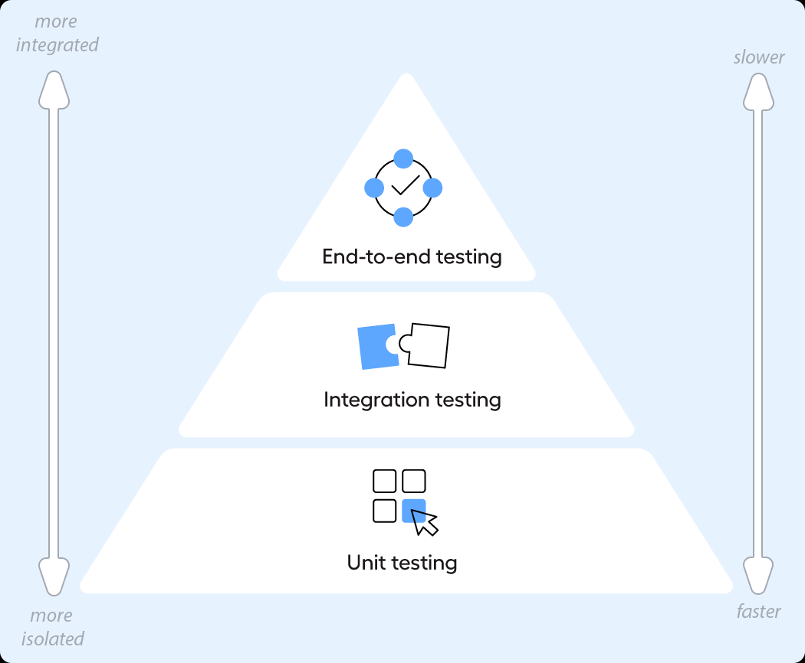

# Unit testing

# 🧪 Unit Testing

Building confidence in your code through systematic testing

## 🎯 Why Unit Testing Matters

**⚠️ Reality Check:** You risk embarrassment to the client if something doesn't work properly during a demo or, even worse, in production. Testing is your safety net!

Everyone knows that the code you write needs to be thoroughly tested. But how do you go about it? What exactly should you test, and how should you do it?

*Mike Cohn's Testing Pyramid*

One form of testing you can use is  **unit testing** . In this context, a unit is, for example, a component with a specific interface. A class is an example of such a unit. All publicly accessible aspects of a class can (and should) be tested.

**📘 Key Principle:** An important aspect of unit testing is to make sure the unit is **small enough to test in isolation** without dependencies on other units.

**💡 Important Note:** Keep in mind that having only unit tests is insufficient; they typically serve as the first automated tests to run before others. For a complete testing strategy, refer to Mike Cohn's test pyramid which includes more types of tests covered in later software semesters.

## 🔧 Unit Testing Fundamentals

### Core Characteristics of Unit Tests:

#### 🎯 Isolation

Tests run independently without relying on external systems, databases, or other units

#### ⚡ Fast Execution

Should complete in milliseconds, enabling rapid feedback during development

#### 🔄 Repeatable

Consistent results every time they run, regardless of environment

#### 📝 Self-Validating

Clear pass/fail result without manual interpretation

## 💡 Best Practices for Unit Testing

#### 🏗️ Arrange-Act-Assert Pattern

Structure your tests clearly: set up data (Arrange), execute the action (Act), verify the outcome (Assert)

#### 📋 Test One Thing at a Time

Each test should verify a single behavior or outcome to maintain clarity and easier debugging

#### 💬 Descriptive Test Names

Use clear, descriptive names that explain what behavior is being tested and expected outcome

## 📚 Learning Resources

**💡 Pro Tip:** Start with the Microsoft documentation for C# unit testing fundamentals, then explore testing frameworks and best practices.

### 📖 Essential Documentation

* **Tutorial:** [Unit test tutorial from Microsoft**Links to an external site.**](https://learn.microsoft.com/en-us/visualstudio/test/walkthrough-creating-and-running-unit-tests-for-managed-code) - Step-by-step guide to creating your first unit tests
* **Frameworks:** [Testing frameworks from Microsoft**Links to an external site.**](https://learn.microsoft.com/en-us/dotnet/core/testing/#testing-tools) - Overview of available testing tools and frameworks
* **Best Practices:** [Best practices from Microsoft**Links to an external site.**](https://learn.microsoft.com/en-us/dotnet/core/testing/unit-testing-best-practices) - Guidelines for writing effective unit tests

### 🔗 Related Course Materials

* [How to write effective unit tests?](https://fhict.instructure.com/courses/15759/pages/how-to-write-effective-unit-tests) - In-depth guide to unit testing techniques
* [How to ensure only the (business) logic is unit tested?](https://fhict.instructure.com/courses/15759/pages/how-to-ensure-only-the-business-logic-is-unit-tested) - Focus your tests on what matters
* [Acceptance Testing and Unit Testing](https://fhict.instructure.com/courses/15759/pages/acceptance-testing-and-unit-testing) - Understanding different types of testing

*Part of the Software Design & Engineering course | Fontys ICT*
