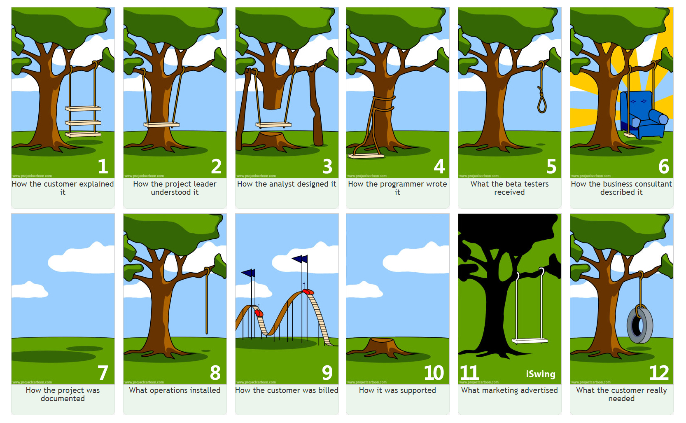

# How can functional requirements be expressed as use cases and a conceptual model?

# 🗺️ From Requirements to Models

Transform functional requirements into use cases and conceptual models that everyone understands

**⚠️ The Communication Problem:** Ever been in a project where everyone thought they understood the requirements, but the final product was completely different from what was expected? That's exactly what we're solving here.

**🎯 Workshop Goal:** Learn to create Use Cases and Conceptual Models that bridge the gap between stakeholder needs and technical implementation. No more swing surprises!

## 🔧 Your Toolkit

**🎭 Use Cases: The User's Story**

Describe how users interact with the system to achieve their goals.

* Focus on **user goals** and **value delivery**
* Written from the user's perspective
* Include main flow and alternative scenarios
* Bridge between business and technical requirements

**🏗️ Conceptual Models: The Data Structure**

Visual representation of data entities and their relationships.

* Show **entities** (things that matter)
* Define **relationships** between entities
* Specify **attributes** and constraints
* Create shared understanding of data structure

## 🔍 Prerequisites Check

 **🧠 Make sure you understand:** * [Stakeholders in software projects**Links to an external site.**](https://devsquad.com/blog/who-are-a-software-projects-stakeholders)

* [Functional vs Non-Functional Requirements](https://fhict.instructure.com/courses/15759/pages/creating-functional-and-non-functional-requirements)
* [Use Cases fundamentals](https://fhict.instructure.com/courses/15759/pages/use-cases-4)
* [Entity-Relationship models**Links to an external site.**](https://www.geeksforgeeks.org/introduction-of-er-model/)

## 💬 Discussion & Questions

Got questions? Discuss with your peers and instructors:

[💬 Join Workshop Discussion](https://fhict.instructure.com/courses/15759/discussion_topics/94075)

## 🚀 Challenge: Build a Document Editor

**📝 The Scenario**

You're building an online technical document editor - think Google Docs, but specialized for technical documentation like URS (User Requirements Specification), test specifications, and project pitches.

**Key Features:**

* Template-based document creation (no blank documents)
* Multiple document types (URS, test specs, pitches)
* Rich metadata tracking (author, dates, word count, etc.)
* Collaborative editing capabilities

### Phase 1: Requirements & Use Cases

**🎯 Your Task:** Work in pairs to create functional requirements and use cases for these core features:1. **Create a new document** - How does a user start a new document?

1. **Save document** - Standard save functionality
2. **Save as new copy** - Create variations and versions

 **💡 Pro Tips:** * Focus on  **user goals** , not system functions

* Consider **alternative flows** - what if the template isn't available?
* Think about **preconditions** - what must be true before the use case starts?
* Define **success criteria** - how do you know the use case succeeded?

### Phase 2: Conceptual Model (EER)

**🏗️ Build Your Data Model:** Create an Enhanced Entity-Relationship (EER) diagram that shows:1. **Entities** - What are the "things" in your system?

1. **Relationships** - How do these entities connect?
2. **Attributes** - What properties does each entity have?

 **🤔 Think About:** * What's a  **Document** ? What's a  **Template** ?

* How do **Users** relate to  **Documents** ?
* What **metadata** needs to be tracked?
* How do you handle **versions** and  **collaboration** ?

## ✅ Validation & Feedback

 **🔄 Iterate & Improve:** * Compare your use cases with the conceptual model - do they align?

* Present your work to instructors for feedback
* Refine based on feedback and peer discussions
* Ensure consistency across all deliverables

## 🎯 Learning Outcome Connection

**LO1: Analysis - Documentation & Validation**

This workshop directly supports your ability to "analyze and document validated user specifications based on stakeholder feedback."

* **Use Cases** help you understand and document user needs
* **Conceptual Models** provide a foundation for system design
* **Validation** ensures stakeholder alignment before implementation

## 🚀 Next Steps

**⏭️ Ready for Implementation?** Continue with [From Conceptual to Implementation Models](https://fhict.instructure.com/courses/15759/pages/how-to-go-from-a-conceptual-diagram-to-concrete-diagrams-for-implementation-purposes) to transform your designs into executable code.

*💡 Pro Tip: The artifacts you create here will be essential for your individual project's URS. Take time to make them solid!*
