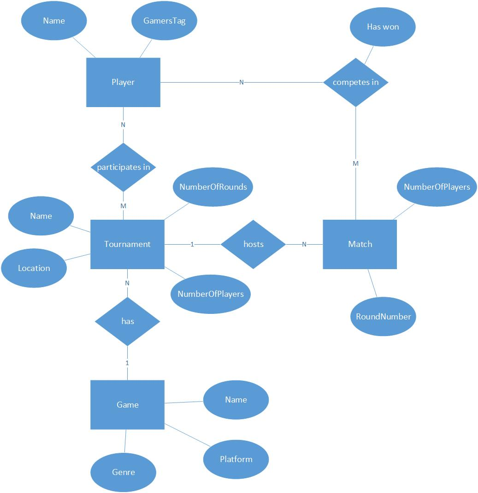

# How to go from a conceptual diagram to concrete diagrams for implementation purposes?

# 🏗️ From Concept to Code

Transform abstract ideas into concrete implementation blueprints

**🎯 The Challenge:** You've analyzed the problem and created a conceptual model. Now what? How do you bridge the gap between abstract understanding and actual implementation? This workshop teaches you to translate concepts into executable designs.

## 🛤️ The Implementation Journey

#### Phase 1: Conceptual Understanding

What entities exist? How do they relate? What's the business logic?

#### Phase 2: Data Design (ERD)

How will we structure and store the data? What are the constraints?

#### Phase 3: Code Design (Class Diagram)

How will we structure the code? What are the responsibilities?

## 🎮 Workshop Scenario: Gaming Tournament Platform

**🏆 Your Challenge: Tournament Management System**

You're building a platform where gamers can register for tournaments. Think of it as the "Eventbrite for esports" - players need to find tournaments, register, and tournament organizers need to manage everything.

## 🔍 Prerequisites Check

 **🧠 Essential Knowledge:** * Understanding of [conceptual models and use cases](https://fhict.instructure.com/courses/15759/pages/how-can-functional-requirements-be-expressed-as-use-cases-and-a-conceptual-model)

* Basic knowledge of databases and object-oriented programming
* Familiarity with [class diagrams](https://fhict.instructure.com/courses/15759/pages/class-diagram)

## 💬 Discussion & Questions

Questions about the transformation process? Join the discussion:

[💬 Workshop Discussion](https://fhict.instructure.com/courses/15759/discussion_topics/94070)

## 🎯 Workshop Activities

### 🔍 Activity 1: Analyze the Concept

 **🤔 Critical Questions:** * What story does this conceptual model tell?

* What business rules can you infer?
* What's missing that you'd expect in a tournament platform?
* What assumptions is this model making?

### 🗃️ Activity 2: Design the Data (ERD)

**📊 From Concept to Database**

Transform the conceptual model into an Entity-Relationship Diagram (ERD):

* **Entities:** What tables do you need?
* **Attributes:** What fields does each table have?
* **Relationships:** How do tables connect?
* **Constraints:** What are the business rules?

 **💡 Data Design Tips:** * Think about **data types** and **constraints**

* Consider **nullable fields** and **default values**
* Plan for **data integrity** and **performance**
* Don't forget **audit fields** (created_at, updated_at, etc.)

### 🏗️ Activity 3: Design the Code (Class Diagram)

**🧩 From Concept to Classes**

Create a Class Diagram that reflects the business logic:

* **Classes:** What objects represent your entities?
* **Methods:** What behaviors do these objects have?
* **Properties:** What data does each class encapsulate?
* **Relationships:** How do classes interact?

 **🎯 Code Design Tips:** * Focus on **single responsibility** per class

* Think about  **behaviors** , not just data storage
* Consider **abstraction** and **inheritance**
* Plan for **testability** and **maintainability**

### 🚀 Activity 4: Rapid Prototyping

 **⚡ Quick Implementation:** 1. **Database:** Create tables and relationships

1. **Classes:** Implement basic class structure
2. **Validation:** Does your implementation match your design?
3. **Testing:** Can you create sample data and basic operations?

## 🤝 Peer Review & Reflection

 **💭 Discussion Points:** * How do ERDs help with development planning and team communication?

* What role do class diagrams play in code quality and maintainability?
* What differences emerged between teams, and why?
* What challenges did you encounter during implementation?

## 🎯 Learning Outcome Connection

**LO2: Design - Software & Database Design**

This workshop directly supports your ability to "methodically translate validated user specifications into software and database designs."

* **ERDs** demonstrate database design skills
* **Class diagrams** show software architecture planning
* **Implementation** validates your design decisions

## 🚀 Next Steps

 **📈 Your Development Journey:** 1. Apply these techniques to your individual project

1. Explore [SOLID principles](https://fhict.instructure.com/courses/15759/pages/how-can-solid-help-with-designing-maintainable-code) for better class design
2. Get feedback from instructors on your ERD and class diagrams
3. Iterate and refine based on implementation experience

*🎯 Remember: Good design is iterative. Your first ERD and class diagram won't be perfect, and that's OK. The key is to start, implement, learn, and refine.*
