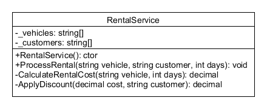
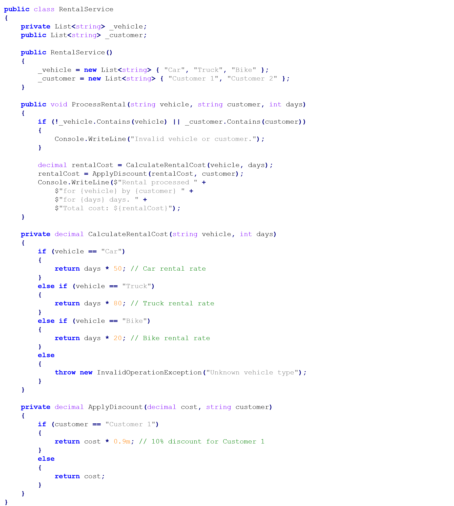

# How can SOLID help with designing maintainable code?

# 🧱 SOLID Principles in Practice

Transform rigid code into flexible, maintainable software architecture

**⚠️ The Maintenance Nightmare:** Bad code isn't just hard to read - it's expensive to maintain. Every change becomes a risk, every new feature a struggle. SOLID principles transform brittle code into flexible architecture that welcomes change instead of fighting it.

**🎯 Workshop Goal:** Master the 5 SOLID principles by refactoring real code. Learn to identify violations, understand their impact, and apply solutions that make your code maintainable, extensible, and testable.

## 🏗️ The SOLID Foundation

**S - Single Responsibility Principle**

**"A class should have one reason to change"**

Each class should do one thing well. When a class has multiple responsibilities, changes to one responsibility can break others.

**O - Open/Closed Principle**

**"Open for extension, closed for modification"**

You should be able to add new functionality without changing existing code. This reduces the risk of breaking what already works.

**L - Liskov Substitution Principle**

**"Subtypes must be substitutable for their base types"**

If you have a base class, you should be able to replace it with any of its subclasses without breaking the program.

**I - Interface Segregation Principle**

**"Many specific interfaces are better than one general-purpose interface"**

Don't force classes to implement interfaces they don't need. Keep interfaces focused and specific.

**D - Dependency Inversion Principle**

**"Depend on abstractions, not concretions"**

High-level modules shouldn't depend on low-level modules. Both should depend on abstractions.

## 🛠️ Prerequisites & Setup

 **🧠 Essential Knowledge:** * [Object-oriented programming](https://fhict.instructure.com/courses/15759/pages/object-oriented-programming-in-practice) fundamentals

* [Maintainable code design](https://fhict.instructure.com/courses/15759/pages/how-to-start-designing-maintainable-code) concepts
* Understanding of domain models, business logic, and persistence layers

 **📚 Recommended Reading:** * [SOLID Principles](https://fhict.instructure.com/courses/15759/pages/solid-principles "SOLID Principles")

* [Uncle Bob&#39;s SOLID Principles**Links to an external site.**](http://www.butunclebob.com/ArticleS.UncleBob.PrinciplesOfOod)
* [SOLID Principles with Real Examples**Links to an external site.**](https://medium.com/@cibofdevs/understanding-solid-principles-in-java-with-real-life-examples-d6fe93b0acc2)

## 💬 Discussion & Questions

Questions about SOLID principles and code refactoring?

[💬 Join SOLID Discussion](https://fhict.instructure.com/courses/15759/discussion_topics/94081)

## 🚗 Refactoring Challenge: Rental Service

**🎯 The Problem: Violating Every SOLID Principle**

You've inherited a `RentalService` that works, but it's a maintenance nightmare. It handles customer requests, calculates prices, applies discounts, and manages different vehicle types - all in one massive class.

### Phase 1: SOLID Violation Detection

 **🔍 Detective Work - Analyze Each Principle:** * **SRP Violation:** How many responsibilities does `RentalService` have?

* **OCP Violation:** What happens when you need to add a new vehicle type?
* **LSP Violation:** Are there any problematic inheritance relationships?
* **ISP Violation:** Are there any fat interfaces forcing unnecessary dependencies?
* **DIP Violation:** Is the class depending on concrete implementations?

 **💡 Analysis Questions:** * What would break if you changed the discount calculation logic?

* How hard would it be to add a new vehicle type like "Motorcycle"?
* Can you test the pricing logic independently of the database?
* What if you needed to support multiple pricing strategies?

### Phase 2: Collaborative Refactoring

**🤝 Team Refactoring Strategy**

**Work together to design a better solution:**

1. **Identify responsibilities** and extract them into separate classes
2. **Create abstractions** for pricing, discounts, and vehicle management
3. **Design interfaces** that support extensibility
4. **Implement dependency injection** for loose coupling
5. **Validate with scenarios** - adding new vehicle types and pricing rules

 **🎯 Refactoring Approach:** * **Extract classes:** `PricingService`, `DiscountService`, `VehicleRepository`

* **Create abstractions:** `IPricingStrategy`, `IDiscountCalculator`
* **Implement patterns:** Strategy pattern for pricing, Factory pattern for vehicles
* **Add dependency injection:** Constructor injection for better testability

### Phase 3: Implementation & Validation

 **🔧 Implementation Steps:** 1. **Create UML diagram** showing your refactored design

1. **Implement the refactored code** following SOLID principles
2. **Test extensibility** by adding a new vehicle type
3. **Validate testability** by writing unit tests for each component
4. **Compare before/after** - document the improvements

 **✅ Success Criteria:** * Each class has a single, clear responsibility

* Adding new vehicle types requires no existing code changes
* Components can be tested independently
* Dependencies are injected, not hardcoded
* Interfaces are focused and specific

## 🎯 Learning Outcome Connection

**LO2: Design & LO3: Implementation**

SOLID principles demonstrate your mastery of:

* **Maintainable design:** Code that's easy to modify and extend
* **Security considerations:** Proper abstraction and encapsulation
* **Software principles:** Industry-standard design patterns
* **Iterative development:** Continuous improvement through refactoring

## 🚀 Next Steps

**⏭️ Ready for Advanced Architecture?** Continue with [Anemic vs Rich Models](https://fhict.instructure.com/courses/15759/pages/how-do-anemic-models-compare-to-rich-models) to explore different approaches to domain modeling and learn when to use each pattern.

**🎯 Apply to Your Project:** Review your individual project code against SOLID principles. Identify violations and create a refactoring plan. Clean architecture pays dividends throughout the development lifecycle.

*🏗️ Architecture Truth: SOLID principles aren't rules to follow blindly - they're tools to solve specific problems. Use them when they add value, not because they're "best practices."*
