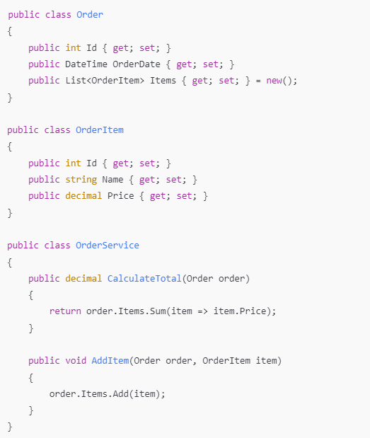

# How do anemic models compare to rich models?

# 🧠 Anemic vs Rich Domain Models

Master the art of domain modeling and choose the right approach for your context

**⚠️ The Architecture Debate:** One of the most heated debates in software architecture is whether to use anemic or rich domain models. There's no universally "correct" answer - the best choice depends on your team, project complexity, and business requirements. Understanding both approaches is crucial for making informed architectural decisions.

**🎯 Workshop Goal:** Master both domain modeling approaches by transforming real code between anemic and rich models. Learn to evaluate trade-offs and choose the right pattern for your specific context.

## 🔍 Understanding the Patterns

**🩻 Anemic Domain Model**

**Philosophy:** "Data and behavior are separate concerns"

* **Domain objects:** Simple data containers (getters/setters)
* **Business logic:** Lives in service classes
* **Approach:** Procedural programming with objects
* **Best for:** Simple CRUD operations, data transformation

**💪 Rich Domain Model**

**Philosophy:** "Objects know how to behave"

* **Domain objects:** Encapsulate both data and behavior
* **Business logic:** Lives within the domain objects
* **Approach:** True object-oriented programming
* **Best for:** Complex business rules, domain-driven design

## ⚖️ The Trade-offs

**📊 Comparison Matrix**

| Aspect                    | Anemic Model                    | Rich Model                    |
| ------------------------- | ------------------------------- | ----------------------------- |
| **Complexity**      | Simple to understand            | Requires OOP mastery          |
| **Testability**     | Easy to mock services           | Domain logic is isolated      |
| **Maintainability** | Logic scattered across services | Business rules colocated      |
| **Performance**     | Efficient for simple operations | May have more object overhead |
| **Team Adoption**   | Easy for junior developers      | Requires design expertise     |

## 🛠️ Prerequisites & Setup

 **🧠 Essential Knowledge:** * Strong understanding of object-oriented programming

* Familiarity with domain models, business logic, and persistence layers
* Basic understanding of [SOLID principles](https://fhict.instructure.com/courses/15759/pages/solid-principles "SOLID Principles")
* Recommended reading: [Anemic vs Rich Domain Models**Links to an external site.**](https://medium.com/@ytanikin/inside-domain-driven-design-contrasting-anemic-and-rich-domain-models-a0287e7c43e7)

## 🛒 Transformation Challenge: Order Management System

**🎯 Starting Point: Anemic Model**

Here's a typical anemic model for an order management system:

**Characteristics of this anemic model:**

* **Domain objects:** Simple data containers
* **Business logic:** All in OrderService
* **Behavior:** Procedural programming style
* **Encapsulation:** Data and behavior are separated

### Phase 1: Anemic Model Analysis

 **🔍 Critical Analysis Questions:** * **Responsibility:** What responsibilities does OrderService have?

* **Encapsulation:** Are related data and behavior kept together?
* **Testability:** How would you test business logic in this design?
* **Maintainability:** Where would you add new business rules?
* **Reusability:** Can you use Order objects in different contexts?

 **🤔 Consider These Scenarios:** * What if you need to add a loyalty discount system?

* How would you handle different tax calculation rules?
* What if orders can have different states (pending, confirmed, shipped)?
* How would you validate business rules before persisting?

### Phase 2: Rich Model Transformation

**🔄 Refactoring Strategy**

**Transform the anemic model into a rich model:**

1. **Identify business behaviors** in OrderService
2. **Move behavior to domain objects** where it belongs
3. **Encapsulate invariants** within the domain objects
4. **Add domain-specific methods** like AddItem(), RemoveItem(), ApplyDiscount()
5. **Ensure data consistency** through proper encapsulation

 **🎯 Rich Model Design Goals:** * **Behavioral encapsulation:** Objects know how to behave

* **Business rule enforcement:** Invariants are protected
* **Domain language:** Methods reflect business terminology
* **Self-validation:** Objects ensure their own consistency

### Phase 3: Comparative Analysis

 **🔬 Deep Dive Analysis:** * **Responsibility changes:** How did roles shift between service and domain objects?

* **Testing implications:** Which approach makes testing easier and why?
* **Maintenance scenarios:** How would each handle complex business rule changes?
* **Team considerations:** Which approach fits your team's skills and preferences?
* **Performance impact:** What are the performance implications of each approach?

## 🎯 When to Use Each Approach

#### Choose Anemic Models When:

* Building simple CRUD applications
* Working with junior developers
* Integrating with frameworks that expect data objects
* Performance is critical and object overhead matters
* Business logic is primarily data transformation

#### Choose Rich Models When:

* Complex business rules and domain logic
* Domain-driven design approach
* Team experienced with OOP principles
* Long-term maintainability is priority
* Business rules change frequently

## 🤝 Workshop Execution

 **🔄 Collaborative Process:** 1. **Form teams** to analyze the anemic model together

1. **Design the rich model** with UML diagrams
2. **Implement the transformation** with proper encapsulation
3. **Test both approaches** with realistic scenarios
4. **Present findings** to the class with code examples

## 🎯 Learning Outcome Connection

**LO2: Design & LO3: Implementation**

Domain modeling demonstrates your ability to:

* **Make architectural decisions** based on context and requirements
* **Apply OOP principles** effectively in different scenarios
* **Design maintainable systems** that evolve with business needs
* **Balance trade-offs** between different design approaches

## 🚀 Next Steps

**🎯 Apply to Your Project:** Evaluate your individual project's domain model. Are you using anemic or rich models? Is this the right choice for your context? Consider refactoring if needed, but document your architectural decisions and trade-offs.

**⏭️ Continue Learning:** Explore advanced patterns like Domain Services, Aggregates, and Event Sourcing to further enhance your domain modeling skills.

*🎭 Modeling Truth: The best domain model is the one that serves your team and business needs. Don't chase architectural purity if it doesn't add value to your specific context.*
