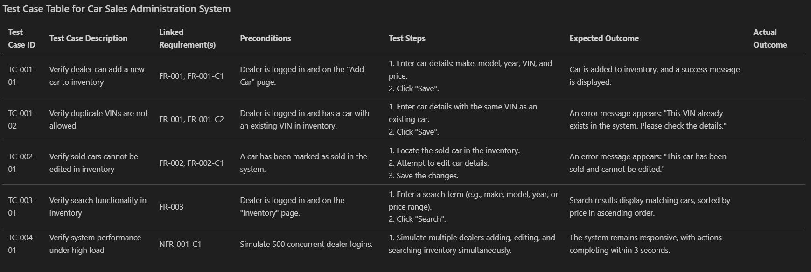
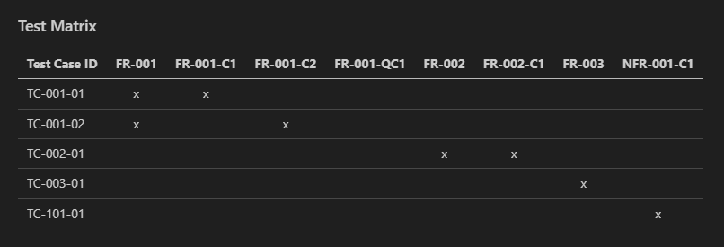

# Acceptance Testing

> Source: Canvas > Resources > Analysis > Acceptance Testing
> Last updated: 2026-02-10
> Status: complete

# ✅ Acceptance Testing

Ensuring your solution meets user requirements

## 🎯 What is User Acceptance Testing (UAT)?

**💡 Key Goal:** Ensure that the solution fulfills the (non-)functional requirements and all their specific constraints and criteria as defined in the analysis phase.

### Core Principles of UAT:

#### 👥 End User Perspective

Tests are conducted from the perspective of the end user, not the developer.

#### 🏭 Production-like Environment

Performed on an environment that closely resembles production, including integrations.

#### 🛡️ Risk Reduction

Helps reduce risks post-release by catching issues before delivery.

**⚠️ Pro Tip:** Start writing test cases early in your development cycle - they're closely tied to your requirements and use cases. It's often the final step before software delivery.

## 🔄 Acceptance Testing in the Development Process

## 📋 Writing Test Cases

**💡 Structure:** Here's a possible structure for an acceptance test case based on a functional requirement.

### Example Test Case Structure:

**Requirement:** "The car dealer can add a new car to the inventory."

* **Test Case ID:** TC-001-01
* **Description:** Verify dealer can add a new car to inventory
* **Preconditions:** Dealer is logged in and on the "Add Car" page
* **Steps:**
  1. Enter car details: make, model, year, VIN, and price
  2. Click "Save"
* **Expected Result:** Car is added to inventory, and a success message is displayed
* **Actual Result:** *(to be filled during test execution)*

**⚠️ Important:** Test cases should be written so that a user without technical background or system knowledge can perform the test. Keep it simple and clear!

## 📊 Test Case Examples

**📘 ID Structure:** Test case IDs can reference relevant requirements or use cases (e.g., TC-001-01 where the first number matches a use case).

*Figure 1: Example test cases*

You might find that test cases resemble your use cases - both define preconditions and steps. You can structure test cases to reference a use case and its particular flow, then only provide the input values to be used.

## 🔗 Traceability Matrix

**💡 Coverage Check:** To ensure all requirements, constraints, and quality criteria are covered, create a traceability matrix.

A traceability matrix helps you verify complete coverage:

* **Empty columns:** May prompt you to add missing test cases
* **Empty rows:** Suggest adding requirements or requirement specifications

*Figure 2: Test Matrix*

## 📄 Test Report

When a user executes the test cases, the actual results can be recorded in a test report.

### A Test Report Should Include:

* **Actual Results:** What happened during test execution
* **Recommendations:** Based on results - release ready or postpone?
* **Requirement Revisions:** Do requirements need to be updated?
* **Additional Insights:** What else do the results suggest?

## 🤖 Test Automation

**📘 Advanced Topic:** While not formally part of this semester, automated end-to-end testing can be a good addition to manual UAT.

**⚠️ Important:** Automated frameworks do **not** fully replace manual UAT - they complement it.

### Automation Examples (Optional):

* Selenium example tests in .NET
* Playwright example tests in .NET

## 📚 Additional Resources

**💡 Pro Tip:** Start with Dutch resources for fundamentals, then explore international articles for broader perspectives on UAT best practices.

### 📖 Recommended Reading

* `https://rubensteins.github.io/s2-db-documentatie/Onderwerpen/TestCases`
* `https://www.altexsoft.com/blog/user-acceptance-testing/`
* `https://www.functionize.com/automated-testing/acceptance-testing-a-step-by-step-guide`
* `https://www.coursera.org/articles/how-to-write-test-cases`
* `https://www.geeksforgeeks.org/test-case/`

