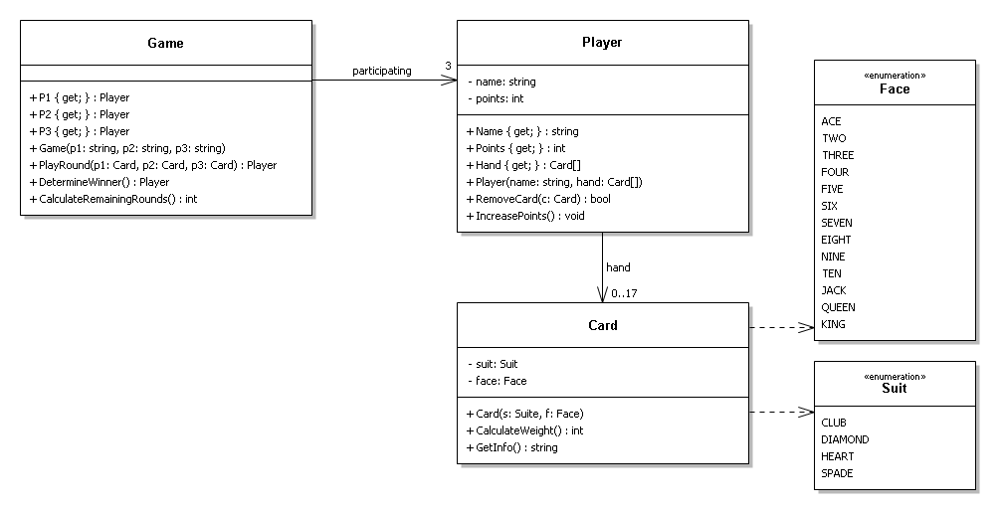
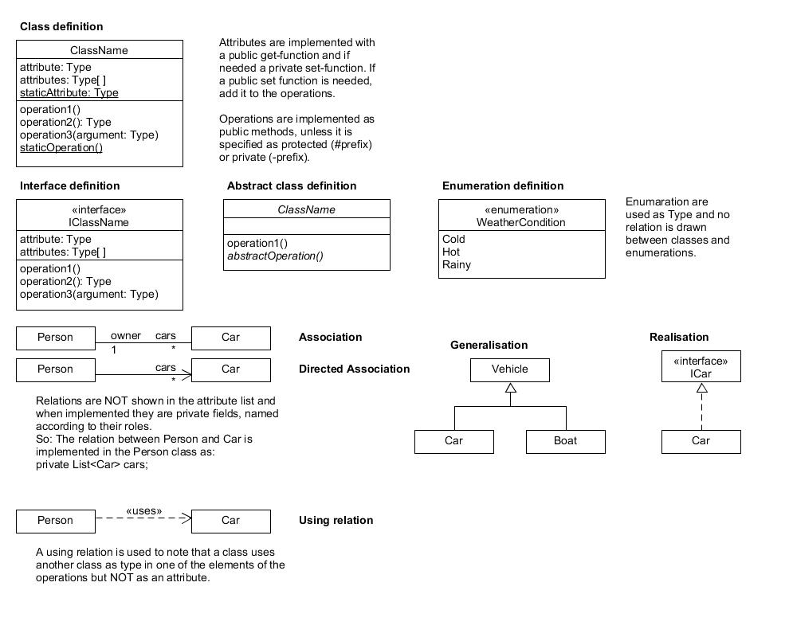

# Class Diagram

> Source: Canvas > Resources > Design > Class Diagram
> Last updated: 2026-02-10
> Status: complete

# 📐 Class Diagram

Modeling the static structure of your software system

## 🎯 What is a Class Diagram?

**💡 Definition:** A class diagram provides an overview of the classes in a system, as well as the relationships between these classes. They model the **static structure** of your software.

### What Class Diagrams Show:

#### 📝 Class Names

The identity of each class in your system.

#### 🏷️ Attributes

The data/properties that each class holds.

#### ⚙️ Methods

The behavior/functions that each class provides.

#### 🔗 Relationships

How classes connect and interact with each other.

## 🚀 Why Use Class Diagrams?

**📘 Key Benefits:** Discuss and validate your design with colleagues **before** you start programming.

### Primary Uses:

* **Design Validation:** Review and discuss system structure with team members
* **Documentation:** Standard way to document your system's structure
* **Communication:** Bridge between technical and non-technical stakeholders
* **Implementation Guide:** Blueprint for coding the actual classes

**⚠️ Best Practice:** Create class diagrams during the design phase, not after coding. They're most valuable when used as a planning tool!

## 📊 Practical Example: Card Game

**💡 Domain Model:** Below is an example depicting a card game domain model, where each 'component' can be implemented as code.


*Figure 1: Example class diagram for a card game*

## 💻 From Diagram to Code

**📘 Important:** Programming languages have different capabilities, so you may need to translate UML concepts to what your language supports.

### Example: Private String Attribute

Consider a private instance variable `name` of type `string` from the Player class:

#### 🔷 C# Implementation

C# is strongly typed with access modifier support:

```csharp
private string name;
```

#### 🐍 Python Implementation

Python is dynamically typed with naming conventions for privacy:

```python
__name
```

*Note: The `__` prefix follows PEP8 coding style as a convention, not syntax.*

## 📚 UML Notation Reference

**💡 Cheat Sheet:** Quick reference for UML class diagram notation and symbols.


*Figure 2: UML Class Diagram Cheat Sheet*

**💡 Pro Tip:** Keep this reference handy when creating your class diagrams - consistent notation makes your diagrams easier to read and understand!

## 📚 Learning Resources

**💡 Learning Path:** Start with the tutorial for fundamentals, then watch videos for practical examples and creation techniques.

### 📖 Tutorials & Guides

* `https://www.tutorialspoint.com/uml/uml_class_diagram.htm`

### 🎥 Video Tutorials

* `https://www.youtube.com/watch?v=UI6lqHOVHic`
* `https://www.youtube.com/watch?v=tKy85WODAUk`

