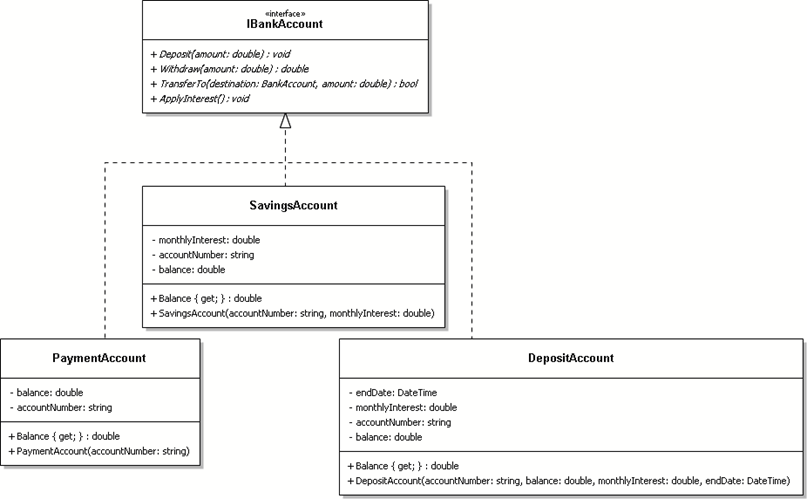
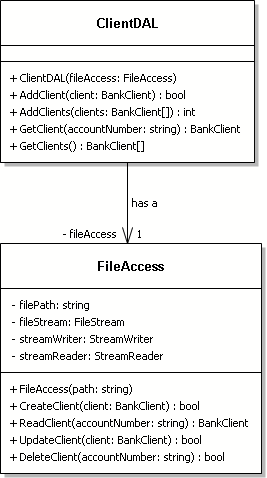

# SOLID Principles

> Source: Canvas > Resources > Design > SOLID Principles
> Last updated: 2026-02-10
> Status: complete

# 🏗️ SOLID Principles

Five fundamental principles for object-oriented design and programming

## 🎯 What are SOLID Principles?

**💡 Core Concept:** SOLID is an acronym for five design principles that help create maintainable, scalable, and robust object-oriented software.

Originally introduced by Robert Martin (Uncle Bob), these principles guide developers in writing code that is:

* **Easy to maintain** - Changes don't break existing functionality
* **Flexible and extensible** - New features can be added without major refactoring
* **Testable** - Components can be tested in isolation
* **Readable and understandable** - Code intent is clear to other developers

**⚠️ Important Note:** These are **principles, not laws**. Use them as guidelines to write better code, but remember that context matters and sometimes breaking a principle might be the right choice.

## S - Single Responsibility Principle

**💡 Definition:** A class should have one (and only one) origin of change.

### ❌ Problematic Situation

Consider a `BankClient` class that handles both client data and database operations. What if in the future we want to:

* Use a different database system
* Apply interest to the balance

This class has **multiple reasons to change**, violating the SRP.


### ✅ Solution

Separate concerns by creating distinct classes:

* `ClientDAL` - Handles database operations
* `BankAccount` - Manages account-related operations
* `BankClient` - Focuses purely on client information


**💡 Key Benefit:** Each class now has a single, well-defined responsibility and only one reason to change.

## O - Open-Closed Principle

**💡 Definition:** Software entities should be open for extension but closed for modification.

### ❌ Problematic Situation

A `BankAccount` class with hardcoded interest calculations. Adding new interest types requires modifying existing code, affecting other classes.


### ✅ Solution

Use interfaces and dependency injection:

```csharp
public interface IInterest
{
    decimal ApplyInterest(decimal balance);
}

public class BankAccount
{
    private IInterest interestPlan;
    // Uses interestPlan.ApplyInterest(balance)
}
```

**💡 Key Benefit:** New interest types can be added by implementing `IInterest` without modifying existing code.


## L - Liskov Substitution Principle

**💡 Definition:** Objects in a program should be replaceable with instances of their sub-types without altering the correctness of that program.

### ❌ Problematic Situation

A `Square` class inheriting from `Rectangle`. While geometrically logical, it breaks substitutability:

```csharp
class Square : Rectangle
{
    public void SetWidth(int width)
    {
        m_width = width;
        m_height = width; // Unexpected behavior!
    }
}
```

### ✅ Solution

Create a common base class `Shape` that both `Rectangle` and `Square` can implement appropriately without violating expected behavior.


**💡 Key Benefit:** Any `Shape` can be replaced with its subclasses without breaking functionality.

## I - Interface Segregation Principle

**💡 Definition:** Many client-specific interfaces are better than one general-purpose interface.

### ❌ Problematic Situation

A `DepositAccount` that implements `IBankAccount` but doesn't need deposit/withdraw functionality. It's forced to implement methods it shouldn't use.



### ✅ Solution

Split the interface into smaller, focused interfaces:

* `IPaymentAccount` - For deposit/withdraw/transfer operations
* `IInterestAccount` - For interest calculations

Now different account types can implement only the interfaces they need:

* **PaymentAccount:** Implements `IPaymentAccount`
* **SavingAccount:** Implements both interfaces
* **DepositAccount:** Implements only `IInterestAccount`

**💡 Key Benefit:** Classes aren't forced to depend on methods they don't use, reducing coupling and improving maintainability.

## D - Dependency Inversion Principle

**💡 Definition:** One should depend upon abstractions, not concretions.

### ❌ Problematic Situation

A `ClientDAL` class directly dependent on `FileAccess`. This tight coupling makes it impossible to use different storage systems without modifying the DAL.



### ✅ Solution

Introduce an abstraction layer:

```csharp
public interface IStorageAccess
{
    void Save(string data);
    string Load();
}

public class ClientDAL
{
    private IStorageAccess storage;
    // Uses storage interface, not concrete implementation
}
```


Now `ClientDAL` can work with any storage implementation: `FileAccess`, `DatabaseAccess`, `CloudAccess`, etc.

**💡 Key Benefit:** High-level modules are no longer dependent on low-level implementation details, making the system more flexible and testable.

## 📚 Learning Resources

**💡 Learning Path:** Start with Uncle Bob's original articles, then explore practical implementations and real-world examples.

### 📖 Essential Reading

* `https://web.archive.org/web/20150906155800/http://www.objectmentor.com/resources/articles/Principles_and_Patterns.pdf`
* `https://www.freecodecamp.org/news/solid-principles-explained-in-plain-english/`
* `https://www.geeksforgeeks.org/solid-principle-in-programming-understand-with-real-life-examples/`

