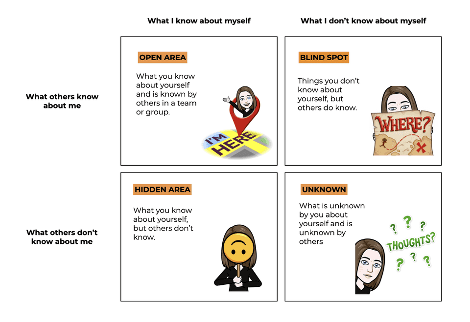

# Feedback

> Source: Canvas > Professional Skills > Feedback
> Last updated: 2026-02-10
> Status: complete

# 🗣️ Feedback

Mastering the art of giving, receiving, and acting on feedback

**🎯 Learning Connection:** Feedback is central to **Learning Outcome 6: Personal Leadership** – taking initiative to request feedback, reflect, and identify your core values for professional development.

## 🤔 What is Feedback?

**Academic Definition**

"Feedback is information provided by an agent (e.g., teacher, peer, book, parent, experience) regarding aspects of one's performance or understanding."

— Hattie, 2007

## 🎯 Why Feedback Matters

- **Educational Foundation**: cornerstone of learning and assessment at Fontys ICT.
- **Self-Awareness**: reveals patterns in your behavior and performance.
- **Direction & Focus**: provides information you need to keep moving in the right direction.

## 🛠️ The 4-Step Feedback Process

### Step 1: Giving Effective Feedback

Four elements:

1. Micro-yes – ask permission and set focus.
2. Be specific – avoid vague terms, mention concrete behavior.
3. Show impact – explain consequences of behavior.
4. Ask for input – invite the other person to think about solutions.

### Step 2: Asking for Feedback

Transform weak questions into strong ones:

- Instead of "Is this good enough?" → "How does this match the learning outcome and where should I focus improvement?"
- Instead of "What do I need to improve?" → "What do you see as my blind spot and what concrete next step would you recommend?"

### Step 3: Receiving Feedback

- Practice active listening and summarizing.
- Avoid defensiveness.
- Ask clarifying questions and request examples.
- Separate message from messenger.
- Take time to reflect before acting.

### Step 4: Practice Peer Feedback

After every iteration:

- Give technical feedback on deliverables and code.
- Give process feedback on collaboration and behavior.
- Use tools like Feedpulse and retrospectives.

## 🔄 Retrospective Techniques

Examples to structure team feedback:

- 4 Ls – Liked, Learned, Lacked, Longed For
- KALM – Keep, Add, More, Less
- Start–Stop–Continue
- Speed Car
- LEGO Retrospective

