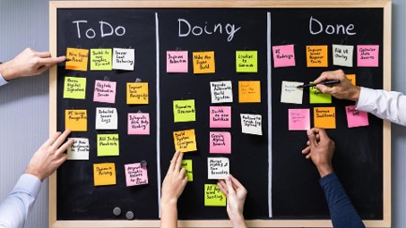

# Planning & Iterations

> Source: Canvas > Professional Skills > Planning & Iterations
> Last updated: 2026-02-10
> Status: complete

# 📅 Planning & Iterations

Master your project organization and iterative development

**🎯 Learning Connection:** Planning directly supports **Learning Outcome 5: Professional Standard** by demonstrating effective project organization and stakeholder communication.

## 🤔 What is Planning?

Planning is making certain that you or your group knows **what to do and when to do it**. It gives you grip on what's needed to successfully finish a project.

Planning is essentially active **before and during** your project work. It's a steering tool that should actually steer your decisions. Unforeseen issues will lead to revised planning – that's normal and expected.

## 🎯 Why Planning Matters

- **Project Control**: Improve your project organization and maintain oversight of complex tasks.
- **Time Management**: ICT projects require long-term discipline for deadlines and self-study.
- **Team Coordination**: Group projects demand effective coordination and shared understanding.
- **Stress Reduction**: Planning reduces stress and increases your likelihood of success.

## 🛠️ How to Plan Effectively

Follow these practical steps, individually or within your project group:

**Step 1: Create a To-Do List**

- Anticipate important deadlines within the semester
- Identify what you need to do in the first weeks before each deadline
- Consider both individual and group project requirements

**Step 2: Define Tasks and Subtasks**

- Divide main tasks into smaller, manageable subtasks
- Ensure tasks aren't too big – you need to see your progress

**Step 3: Think About Priorities & Dependencies**

- Determine which tasks have priority over others
- Consider which tasks are interdependent
- Identify potential bottlenecks in your workflow

**Step 4: Create a Visual Timeline**

- Use a digital tool for better collaboration and updates
- For group projects, add your coach to demonstrate project organization
- Make timelines accessible to all team members

**Step 5: Evaluate Your Planning**

- At the end of each iteration, reflect on what went well
- Identify what needs improvement for next iteration
- Adjust your planning based on your reflection and lessons learned

## 🔧 Recommended Tools

Examples: Trello, GitLab, GitHub Issues, Jira, Azure DevOps.

